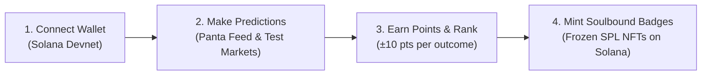

# PredictProof

> **Decentralized Prediction Market Reputation Engine & Soulbound Credentials on Solana**  
> Built for the **Colosseum Crypto World's Fair Hackathon (Panta API Sidetrack)**.

[](https://predict-proof.vercel.app)
[](https://youtu.be/0arFMtBLoxY)
[](https://solana.com)
[](https://explorer.solana.com/address/BMwNMcrxpmGu7V9fHpFyGN8dFKt5NrAPNusZSLrUbafz?cluster=devnet)

---

## Quick Links

- 🌐 **Live Web Application**: [https://predict-proof.vercel.app](https://predict-proof.vercel.app)
- 📺 **Video Walkthrough & Architecture Explanation**: [https://youtu.be/0arFMtBLoxY](https://youtu.be/0arFMtBLoxY)
- ⛓️ **Solana Devnet Program ID**: [`BMwNMcrxpmGu7V9fHpFyGN8dFKt5NrAPNusZSLrUbafz`](https://explorer.solana.com/address/BMwNMcrxpmGu7V9fHpFyGN8dFKt5NrAPNusZSLrUbafz?cluster=devnet)
- 🐙 **GitHub Repository**: [https://github.com/Akshat0125/PredictProof](https://github.com/Akshat0125/PredictProof)

---

## Overview

In modern prediction markets, forecasters and bettors generate immense predictive intelligence, but their track record is traditionally trapped inside siloed databases or lost when positions settle. 

**PredictProof** turns predictive foresight into permanent, portable Web3 reputation:
1. **Aggregates Binary Market Odds**: Ingests real-time prediction markets via the **Panta API**.
2. **Computes Verifiable Forecaster Accuracy**: Scores predictors using a transparent engine evaluating win rate, win streaks, and high-conviction underdog calls.
3. **Mints Soulbound Credentials on Solana**: Predictors who hit verified performance milestones can mint non-transferable, soulbound NFT badges on **Solana Devnet**. Each badge is an SPL token frozen directly in the recipient's token account, ensuring reputation cannot be bought, sold, or transferred.

---

## How PredictProof Works (User Guide)



### 1. Connect Your Solana Wallet
Visit [predict-proof.vercel.app](https://predict-proof.vercel.app) and connect your Solana wallet (Phantom, Solflare, Backpack) switched to **Solana Devnet**. Devnet airdrop faucets provide testing SOL for transaction fees.

### 2. Practice with Demo Prediction Markets
Navigate to the **Predict** tab (`/predict`):
- New wallets receive an initial **100 PTS** balance.
- Browse active test questions across crypto, tech, politics, and macroeconomics.
- Choose **Predict YES** or **Predict NO** on binary outcomes with zero capital at risk.

### 3. Track Performance & Climb Monthly Leaderboards
- Navigate to **Leaderboard** (`/leaderboard`) to view:
  - **This Month**: Ranked by net points earned from resolved markets during the current calendar month (±10 pts per resolved pick).
  - **All-Time Accuracy**: Ranked by overall score, win percentage, active streaks, and unlocked badge tiers.
- Check **My Profile** (`/profile/[wallet]`) to inspect your interactive cumulative points history chart, win/loss breakdown, and past picks.

### 4. Mint Soulbound NFT Badges
When your prediction record satisfies a tier threshold, the **Claim Soulbound Badge** button activates on your profile. Clicking claim executes an on-chain transaction calling the PredictProof Anchor program on Solana Devnet:
1. Verifies the Event PDA for that badge tier.
2. Mints an SPL NFT to your wallet's Associated Token Account.
3. Automatically **freezes the token account**, locking the NFT as non-transferable proof of your forecasting accuracy.

---

## Core Features

### 1. Live Panta Market Feed
- Real-time binary prediction markets fetched directly from the Panta API (`https://panta.run`).
- Displays implied probability bars, volume metrics, resolution timestamps, and categories.
- Built-in sandbox fallback fixtures for resilient offline demonstration.

### 2. Multi-Factor Reputation Scoring Engine
Reputation is calculated across multiple dimensions:
- **Baseline Accuracy**: Percentage of correct calls ($Wins / Total$).
- **Streak Multipliers**: Consecutive winning predictions grant compounding bonuses ($streak \ge 3 \implies +0.5 \times streak$).
- **Underdog Contrarian Multipliers**: Rewards contrarian foresight on winning calls entered at steep underdog odds ($\le 15¢$ or $\le 50¢$).

### 3. Soulbound On-Chain Credentials (4 Tiers)
Registered and verified via Solana Devnet Anchor Program:
- **Bronze Predictor v2**: Baseline track record (3+ correct picks).
- **Silver Forecaster v2**: Consistent forecasting accuracy (7+ correct picks at $\ge 60\%$ accuracy).
- **Gold Oracle v2**: Elite market foresight (15+ correct picks at $\ge 75\%$ accuracy).
- **Underdog Sniper v2**: Specialist contrarian winner (successful pick with entry odds $\le 15¢$).

### 4. Points Simulation Engine & Monthly Competition
- Backed by Supabase PostgreSQL for high-speed state synchronization.
- Real-time balance updates and cached-busting Next.js server route handlers.
- Interactive Recharts points history visualization on user profiles.
- Demo mode simulation toggles for frictionless evaluation and testing of badge claims.

---

## Architecture & Monorepo Structure

PredictProof is organized as a unified monorepo containing both the full-stack web application and the Solana Anchor on-chain program:

```text
PredictProof/
├── anchor/                                # Solana Anchor Smart Contract Workspace
│   ├── programs/event-attendance-nft/     # Rust smart contract source (lib.rs)
│   ├── tests/                             # TypeScript Anchor test suite (soulbound verification)
│   ├── target/idl/                        # Generated program IDL (event_attendance_nft.json)
│   ├── target/types/                      # Generated TypeScript types (event_attendance_nft.ts)
│   ├── Anchor.toml                        # Anchor configuration & devnet program deployment
│   └── Cargo.toml                         # Cargo workspace configuration
├── app/                                   # Next.js App Router Pages & API Routes
│   ├── page.tsx                           # Live Panta prediction market feed
│   ├── predict/page.tsx                   # Demo prediction game & points engine
│   ├── leaderboard/page.tsx               # Monthly & all-time accuracy leaderboards
│   ├── profile/                           # Profile router & [wallet]/page.tsx stats/charts
│   └── api/                               # Serverless API routes (Supabase points & markets)
│       ├── markets/test/route.ts          # Test markets endpoint (force-dynamic)
│       ├── predictions/route.ts           # Prediction submission & user pick status
│       ├── wallet/[wallet]/route.ts       # Points balance & history endpoint
│       └── leaderboard/monthly/route.ts   # Monthly standings aggregation
├── components/                            # Reusable React UI Components
│   ├── icons/                             # Custom inline SVG icon system (25 custom icons)
│   ├── BadgeCard.tsx                      # Soulbound badge tier showcase
│   ├── ClaimBadgeButton.tsx               # Solana Anchor devnet NFT minting trigger
│   ├── MarketCard.tsx                     # Polymarket-style binary market odds card
│   ├── MarketFeed.tsx                     # Live odds feed with category filtering
│   ├── PredictionCard.tsx                 # Clean prediction game card (blue/red theme)
│   ├── Navbar.tsx                         # Header with points balance pill & wallet connector
│   └── WalletButton.tsx                   # Solana wallet adapter modal button
├── lib/                                   # Shared Utilities, Clients, & Scoring Logic
│   ├── badge-config.ts                    # Verified on-chain Event PDAs & metadata URIs
│   ├── event-attendance-nft-exports.ts    # Typed Anchor program client wrapper
│   ├── panta-client.ts                    # Panta API client & local fixture fallbacks
│   ├── points-engine.ts                   # Core points delta math (±10 pts)
│   ├── scoring.ts                         # Accuracy scoring, streak, & tier eligibility math
│   └── supabase-admin.ts                  # Server-only Supabase client
├── scripts/                               # Management & Verification Scripts
│   ├── resolve-market.ts                  # Admin market resolution CLI tool
│   ├── seed-test-markets.ts               # Seeds initial demo prediction markets
│   ├── setup-badge-tiers.ts               # Registers on-chain Event PDAs on Solana devnet
│   └── verify-badge-tiers.ts              # Read-only RPC audit of on-chain badge tiers
├── supabase/                              # Database Schemas & Migrations
│   └── schema.sql                         # PostgreSQL schema (wallets, test_markets, predictions)
└── public/                                # Static Assets & Badge Metadata JSONs
    └── badges/                            # Metadata JSONs (bronze.json, silver.json, etc.)
```

---

## Tech Stack

| Domain | Technologies |
|---|---|
| **Frontend & Runtime** | [Next.js 14](https://nextjs.org) (App Router), React 18, TypeScript, Recharts |
| **Styling & Design** | Tailwind CSS, institutional blue/red prediction market theme, custom SVG icons |
| **Blockchain (Solana Devnet)** | [Anchor Framework](https://www.anchor-lang.com/), Solana Web3.js, Solana Wallet Adapter, SPL Token (freeze authority) |
| **Data & APIs** | [Panta API](https://panta.run) (Live prediction markets), [Supabase](https://supabase.com) (PostgreSQL points engine) |
| **Deployment** | Vercel (Edge network, automated CI/CD) |

---

## Getting Started Locally

### Prerequisites

- **Node.js 18+** (Node v20 or v22 recommended)
- **npm** (or yarn/pnpm)
- **Solana CLI & Anchor CLI** *(optional, only needed for recompiling the smart contract)*

### 1. Clone & Install Dependencies

```bash
git clone https://github.com/Akshat0125/PredictProof.git
cd PredictProof
npm install --legacy-peer-deps
```

### 2. Configure Environment Variables

Create `.env.local` in the project root:

```env
PANTA_API_KEY=your_panta_api_key_here
SUPABASE_URL=your_supabase_project_url_here
SUPABASE_SERVICE_ROLE_KEY=your_supabase_service_role_key_here
```

*(Note: `.env.local` is excluded from git tracking by `.gitignore` for security).*

### 3. Run the Development Server

```bash
npm run dev
```

Open [http://localhost:3000](http://localhost:3000) in your browser.

### 4. Build for Production

```bash
npm run build
```

---

## Testing & Smart Contract Verification

### Anchor Smart Contract Tests
```bash
cd anchor && anchor test
```
Executes the TypeScript Anchor test suite (`tests/event-attendance-nft.spec.ts`), validating event creation, badge minting, and the critical **token freeze instruction** that renders credentials non-transferable.

### On-Chain Badge Verification
```bash
npx tsx scripts/verify-badge-tiers.ts
```
Performs a read-only RPC query against the 4 live Devnet Event PDAs to ensure metadata URIs and event authorities match on-chain state.

### Market Resolution Script
```bash
npx tsx scripts/resolve-market.ts <marketId> <YES|NO>
```
Admin CLI script that resolves test markets, evaluates user picks sequentially, applies points deltas, and updates wallet balances.

---

## Roadmap

The following next steps are planned as production expansion phases:

- **Monthly Champion on-chain badge**: An additional soulbound NFT tier awarded to whoever tops the monthly points leaderboard each month. The underlying mechanism already exists in principle (reusing the same `create_event` / `check_in` pattern as the 4 existing badge tiers), but is intentionally not yet built — crowning a "monthly" winner isn't meaningful until a full month of real prediction data has elapsed.
- **Live Panta market resolution**: Once Panta's production API moves markets beyond the current test-mode sandbox fixture, lifetime accuracy scoring can read directly from real resolved Panta markets instead of the current sample/mock dataset.
- **Expanded test market catalog**: The demo prediction game currently ships with seeded sample questions; this is designed to scale to a larger, rotating set of questions without any schema changes.
- **Automated resolution**: Market resolution currently runs via a manually-invoked admin script (`scripts/resolve-market.ts`); a future version could pull real outcomes from a trusted oracle or news API automatically.

---

## License

MIT © [Akshat0125](https://github.com/Akshat0125)
